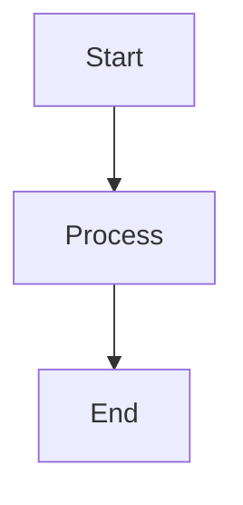

# Contributing to RepoReveal

Thank you for your interest in contributing to RepoReveal! This guide will help you add comprehensive documentation for repositories.

## 🎯 What to Document

We're looking for documentation of:

- **Popular open-source repositories** (1000+ stars recommended)
- **Well-established projects** with active development
- **Projects with complex architectures** that benefit from detailed documentation
- **Repositories lacking comprehensive documentation** in their official docs

## 📝 Contribution Process

### 1. Choose a Repository

Before starting:

1. **Check if it's already documented**: Look in the `docs/` directory
2. **Open an issue**: Claim the repository you want to document
3. **Get approval**: Wait for maintainer approval to avoid duplicate work

### 2. Analyze the Repository

Use the AI agent prompts in `agents/prompts/` to guide your analysis:

1. Start with `01-overview-prompt.md` - Understand the project's purpose
2. Use `02-architecture-prompt.md` - Map out the architecture
3. Apply `03-technical-details-prompt.md` - Document implementation details
4. Follow `04-indepth-guide-prompt.md` - Create practical guides

### 3. Generate Documentation

#### Option A: Using AI Assistants (Recommended)

If you have access to AI coding assistants (GitHub Copilot, Claude, etc.):

1. Clone the target repository locally
2. Use the agent configuration in `agents/doc-generator-agent.md`
3. Apply each prompt from `agents/prompts/` sequentially
4. Review and refine the generated documentation

#### Option B: Manual Documentation

1. Copy templates from `templates/` directory
2. Follow the structure and guidelines in each template
3. Fill in each section with information from the codebase
4. Add diagrams using Mermaid syntax

### 4. Structure Your Documentation

Create a new directory: `docs/{repository-owner}/{repository-name}/`

Include these files:
```
docs/{owner}/{repo-name}/
├── repository-overview.md    # Required
├── architecture.md            # Required
├── technical-details.md       # Required
├── indepth-guide.md          # Required
└── README.md                  # Optional: Index for the documentation
```

### 5. Follow Documentation Standards

#### General Guidelines

- ✅ **Use Markdown**: All documentation should be in `.md` format
- ✅ **Be accurate**: Verify all technical details
- ✅ **Be comprehensive**: Cover all major aspects
- ✅ **Be clear**: Write for developers who may not know the project
- ✅ **Be practical**: Include working code examples
- ✅ **Be current**: Document the latest stable version

#### Formatting Standards

**Code Blocks**: Always specify the language
```python
# Good
def example():
    pass
```

**Diagrams**: Use Mermaid for all diagrams


**File References**: Link to specific files
- ✅ Good: `src/core/engine.py` - Main engine implementation
- ❌ Bad: "The main engine file"

**Headers**: Use clear, hierarchical headers
```markdown
# Main Section
## Subsection
### Detail Level
```

#### Content Requirements

**Repository Overview** must include:
- Project description and purpose
- Key features (at least 5)
- Technology stack
- Statistics (stars, forks, contributors)
- Use cases

**Architecture** must include:
- At least one architecture diagram
- Component descriptions
- Data flow for key operations
- Design patterns identified
- External integrations

**Technical Details** must include:
- Directory structure with explanations
- At least 5 core modules documented
- Configuration options
- Dependencies list
- Build/deployment instructions

**In-Depth Guide** must include:
- Getting started guide
- At least 3 common use cases with examples
- Advanced features
- Best practices
- Troubleshooting section
- FAQ (at least 5 questions)

### 6. Quality Checklist

Before submitting, verify:

- [ ] All required files are present
- [ ] Code examples are tested and working
- [ ] Diagrams render correctly
- [ ] Links are valid and point to correct files
- [ ] Spelling and grammar are correct
- [ ] Formatting is consistent
- [ ] Information is accurate and up-to-date
- [ ] All placeholders (e.g., `{REPOSITORY_NAME}`) are replaced
- [ ] File paths are correct
- [ ] No sensitive information is included

### 7. Submit Your Contribution

1. **Fork the repository**
2. **Create a feature branch**: `git checkout -b docs/add-{repo-name}`
3. **Add your documentation**: Place files in `docs/{owner}/{repo-name}/`
4. **Commit your changes**: Use clear, descriptive commit messages
5. **Push to your fork**: `git push origin docs/add-{repo-name}`
6. **Open a Pull Request**: Use the PR template and provide context

#### Pull Request Template

```markdown
## Repository Documented

**Repository**: {owner}/{repo-name}
**Repository URL**: {github-url}
**Stars**: {count}
**Last Updated**: {date}

## Documentation Checklist

- [ ] Repository overview complete
- [ ] Architecture documented with diagrams
- [ ] Technical details comprehensive
- [ ] In-depth guide includes examples
- [ ] All code examples tested
- [ ] All links verified
- [ ] Diagrams render correctly
- [ ] Followed all contributing guidelines

## Notes

{Any additional context or notes}
```

## 🎨 Style Guide

### Writing Style

- **Be concise**: Get to the point quickly
- **Be specific**: Use concrete examples
- **Be helpful**: Anticipate questions
- **Be objective**: Focus on facts, not opinions
- **Be respectful**: Honor the original project and maintainers

### Code Examples

- **Complete**: Show full, working examples
- **Commented**: Explain what the code does
- **Practical**: Use realistic scenarios
- **Tested**: Verify examples actually work

### Diagrams

- **Clear**: Don't overcomplicate
- **Focused**: One concept per diagram
- **Labeled**: Include clear labels and descriptions
- **Consistent**: Use similar styling throughout

## 🔍 Review Process

1. **Initial Review**: Maintainers check for completeness
2. **Technical Review**: Verify accuracy of technical details
3. **Quality Review**: Check formatting, grammar, and style
4. **Approval**: Once approved, documentation is merged

### Common Feedback

- Missing code examples
- Diagrams too complex or missing
- Incomplete sections
- Formatting inconsistencies
- Links to wrong files/lines
- Outdated information

## 🚀 Advanced Contributions

### Improving Existing Documentation

Found errors or outdated info in existing docs?

1. Open an issue describing the problem
2. Fork and fix
3. Submit a PR with clear explanation

### Enhancing Templates

Have ideas to improve documentation templates?

1. Open an issue to discuss your proposal
2. Submit changes to templates with rationale
3. Provide example of improved output

### Improving AI Agents

Want to enhance the AI agent prompts?

1. Test your changes on multiple repositories
2. Document improvements and results
3. Submit PR with before/after examples

## 📚 Resources

### Understanding the Repository

- Read existing documentation in `docs/` for examples
- Review templates in `templates/`
- Study agent prompts in `agents/prompts/`

### Tools

- **Mermaid**: [Mermaid Documentation](https://mermaid.js.org/)
- **Markdown**: [Markdown Guide](https://www.markdownguide.org/)
- **GitHub Actions**: For testing documentation

### Getting Help

- 💬 **Discussions**: Ask questions in GitHub Discussions
- 🐛 **Issues**: Report problems or request help
- 📧 **Email**: {maintainer email if applicable}

## 🏆 Recognition

Contributors will be:
- Listed in the repository's contributors
- Credited in the documentation they create
- Featured in release notes for significant contributions

## 📜 Code of Conduct

Please be respectful and professional in all interactions. We're all here to help developers understand code better.

## ⚖️ Legal

- Documentation must be your original work or properly attributed
- Respect the original repository's license
- Don't include sensitive information or credentials
- Don't copy proprietary documentation

## 🤝 Questions?

If you have questions not covered here:

1. Check existing issues and discussions
2. Open a new discussion
3. Tag maintainers if urgent

Thank you for helping make complex codebases more accessible to everyone!
