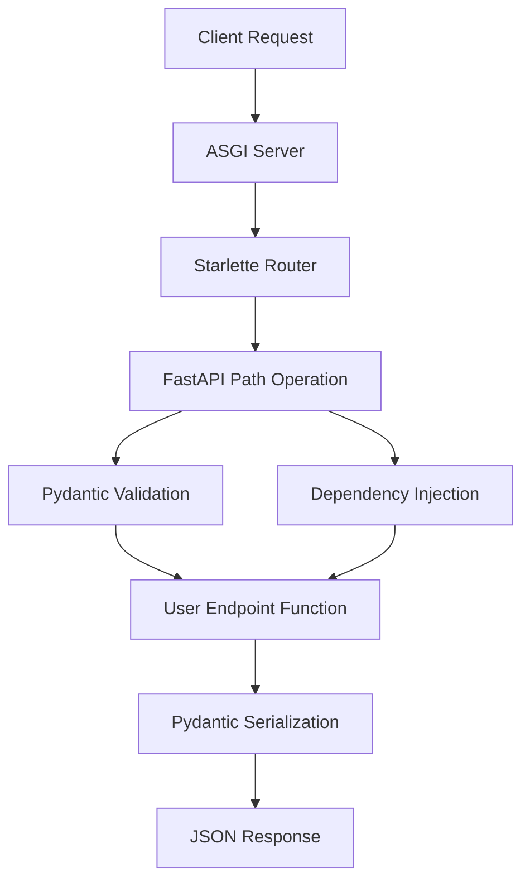
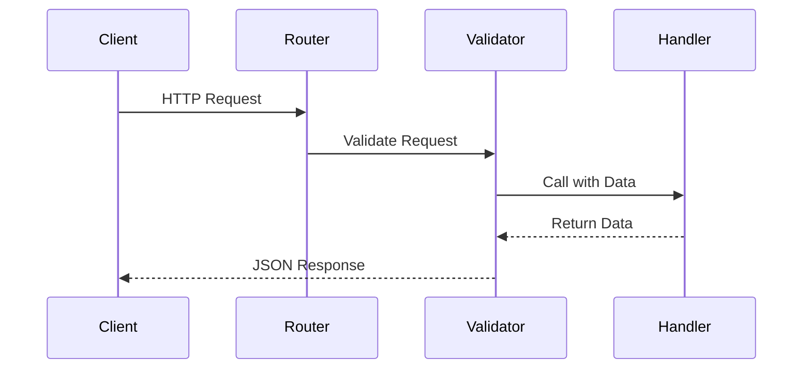

# Architecture: FastAPI

## Overview

FastAPI is built on top of Starlette (for web routing) and Pydantic (for data validation), following a layered architecture that separates concerns while maintaining high performance through async/await patterns.

## Architecture Pattern

**Pattern Type**: Layered Architecture with Dependency Injection

The framework uses a layered approach where:
- **Routing Layer** handles HTTP requests/responses (Starlette)
- **Validation Layer** validates and serializes data (Pydantic)
- **Business Logic Layer** contains application code
- **Documentation Layer** auto-generates OpenAPI specs

## High-Level Architecture Diagram



## Components

### Component 1: ASGI Server Interface

- **Purpose**: Handles async HTTP connections
- **Responsibilities**: Accept HTTP requests, manage async I/O, return responses
- **Key Files**: `fastapi/applications.py`

### Component 2: Routing System

- **Purpose**: Maps URLs to handler functions
- **Responsibilities**: URL pattern matching, HTTP method routing, path parameters
- **Key Files**: `fastapi/routing.py`

### Component 3: Dependency Injection

- **Purpose**: Provides reusable dependencies to endpoints
- **Responsibilities**: Resolve dependency graphs, cache results
- **Key Files**: `fastapi/dependencies/utils.py`

### Component 4: Validation (Pydantic)

- **Purpose**: Validate and serialize data
- **Responsibilities**: Parse request data, type validation, serialize responses
- **Key Files**: `fastapi/encoders.py`

## Data Flow

### Standard API Request



## Design Patterns

### Pattern 1: Dependency Injection

- **Type**: Behavioral
- **Purpose**: Decouple endpoint logic from cross-cutting concerns
- **Example**:
```python
from fastapi import Depends

def get_db():
    db = Database()
    try:
        yield db
    finally:
        db.close()

@app.get("/users/{user_id}")
async def read_user(user_id: int, db = Depends(get_db)):
    return db.get_user(user_id)
```

### Pattern 2: Decorator Pattern

- **Type**: Structural
- **Purpose**: Add metadata to endpoint functions
- **Implementation**: `@app.get()`, `@app.post()` decorators

## Security Architecture

- **Authentication**: OAuth2, JWT via dependencies
- **Authorization**: Custom middleware or dependency-based
- **Data Validation**: Type hints prevent injection attacks

## Scalability Considerations

- **Horizontal Scaling**: Stateless design allows easy scaling
- **Async I/O**: Maximizes single-process efficiency
- **Load Balancing**: Standard HTTP load balancers work transparently

## References

- [Technical Details](./technical-details.md)
- [In-Depth Guides](./indepth-guide.md)
