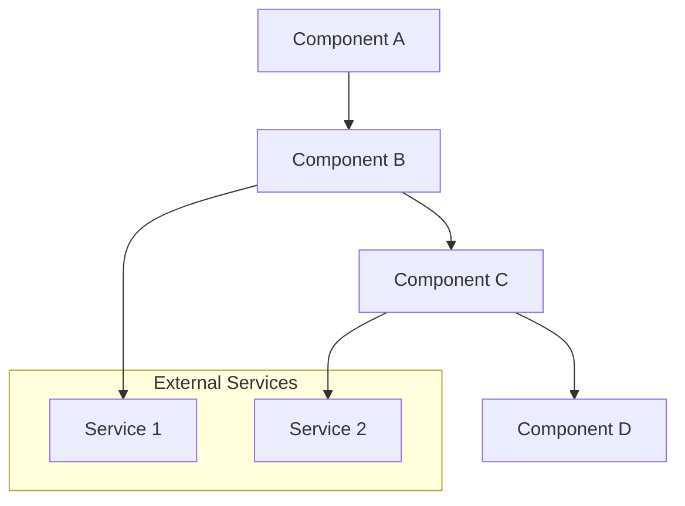
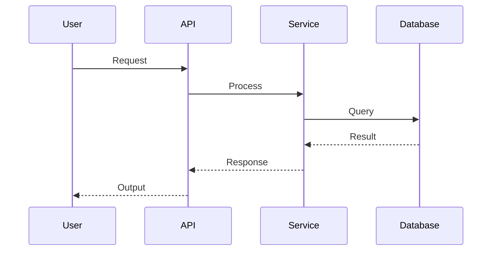
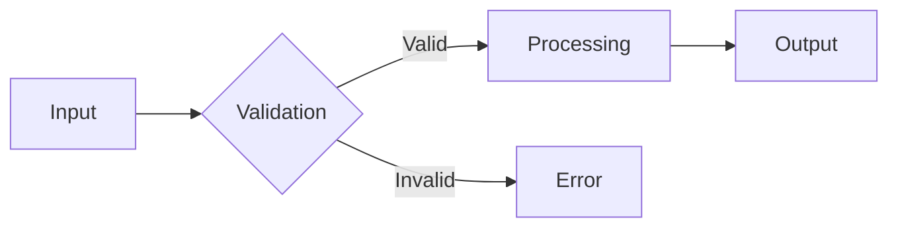
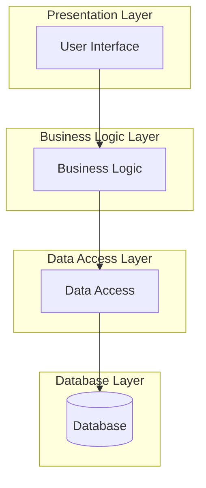

# Architecture: {Repository Name}

## Overview

{High-level description of the architecture and design philosophy}

## Architecture Pattern

**Pattern Type**: {e.g., MVC, Microservices, Layered, Event-Driven, etc.}

{Explain why this pattern was chosen and how it benefits the project}

## High-Level Architecture Diagram



## Components

### Component 1: {Component Name}

- **Purpose**: {What this component does}
- **Responsibilities**: 
  - {Responsibility 1}
  - {Responsibility 2}
- **Dependencies**: {Other components it depends on}
- **Key Files**: 
  - `{path/to/file1}` - {description}
  - `{path/to/file2}` - {description}
- **Interfaces**: {Public APIs or interfaces it exposes}

### Component 2: {Component Name}

- **Purpose**: {What this component does}
- **Responsibilities**: 
  - {Responsibility 1}
  - {Responsibility 2}
- **Dependencies**: {Other components it depends on}
- **Key Files**: 
  - `{path/to/file1}` - {description}
  - `{path/to/file2}` - {description}
- **Interfaces**: {Public APIs or interfaces it exposes}

{Add more components as needed}

## Data Flow

### Flow 1: {Operation Name}

{Description of this data flow}



**Steps**:
1. {Step 1 description}
2. {Step 2 description}
3. {Step 3 description}

### Flow 2: {Operation Name}

{Description of this data flow}



## Design Patterns

### Pattern 1: {Pattern Name}

- **Type**: {e.g., Creational, Structural, Behavioral}
- **Purpose**: {Why this pattern is used}
- **Implementation**: {How it's implemented in the codebase}
- **Location**: `{path/to/implementation}`
- **Example**:
```{language}
// Code example showing the pattern
```

### Pattern 2: {Pattern Name}

- **Type**: {e.g., Creational, Structural, Behavioral}
- **Purpose**: {Why this pattern is used}
- **Implementation**: {How it's implemented in the codebase}
- **Location**: `{path/to/implementation}`

## Layer Architecture

{If applicable, describe the layers}



### Presentation Layer
{Description and key files}

### Business Logic Layer
{Description and key files}

### Data Access Layer
{Description and key files}

## External Integrations

### Integration 1: {Service Name}

- **Purpose**: {What it's used for}
- **Type**: {REST API, GraphQL, SDK, etc.}
- **Authentication**: {How authentication is handled}
- **Key Operations**: {Main operations performed}
- **Configuration**: `{config location}`

### Integration 2: {Service Name}

- **Purpose**: {What it's used for}
- **Type**: {REST API, GraphQL, SDK, etc.}
- **Authentication**: {How authentication is handled}
- **Key Operations**: {Main operations performed}

## Data Storage

### Primary Database

- **Type**: {e.g., PostgreSQL, MongoDB, Redis}
- **Schema**: {High-level schema description}
- **Location**: {How it's configured}
- **Key Tables/Collections**:
  - `{table1}`: {purpose}
  - `{table2}`: {purpose}

### Caching Strategy

- **Technology**: {e.g., Redis, Memcached}
- **What's Cached**: {Description}
- **TTL**: {Time to live settings}
- **Invalidation**: {How cache is invalidated}

## Security Architecture

- **Authentication**: {How users are authenticated}
- **Authorization**: {How permissions are managed}
- **Data Encryption**: {What's encrypted and how}
- **Secrets Management**: {How secrets are stored}
- **Security Boundaries**: {Trust boundaries in the system}

## Scalability Considerations

- **Horizontal Scaling**: {How the system scales horizontally}
- **Vertical Scaling**: {Vertical scaling options}
- **Bottlenecks**: {Known bottlenecks}
- **Load Balancing**: {Load balancing strategy}

## Architectural Decisions

### Decision 1: {Decision Title}

- **Context**: {What led to this decision}
- **Decision**: {What was decided}
- **Rationale**: {Why this decision was made}
- **Consequences**: {Trade-offs and implications}

### Decision 2: {Decision Title}

- **Context**: {What led to this decision}
- **Decision**: {What was decided}
- **Rationale**: {Why this decision was made}
- **Consequences**: {Trade-offs and implications}

## Future Architecture Plans

{Any planned architectural changes or improvements}

## References

- [Technical Details](./technical-details.md)
- [In-Depth Guides](./indepth-guide.md)
